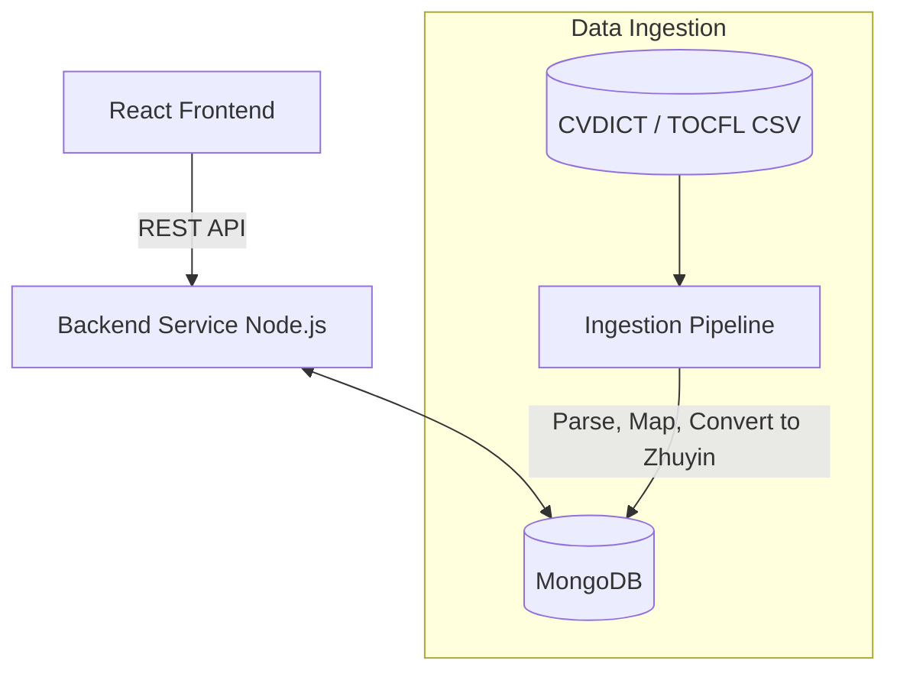

# System Design & Architecture

## Architecture Overview
**High-level system design**

- **Backend Framework:** Node.js with Express (TypeScript).
- **Database:** MongoDB (via Mongoose). Excellent for flexible document storage of dictionary entries and hierarchical lesson data. Mongoose will be used for schema validation.
- **Data Ingestion Pipeline:** A set of scripts (Node.js or Python) to download, parse, and import CVDICT (CC-CEDICT based) and TOCFL CSV/XLSX files into the database.

## Data Models & Schema
**Core entities and their relationships**

1.  **Topic (Chủ đề)** (MongoDB Collection: `topics`)
    - `_id` (ObjectId)
    - `title` (String, e.g., "打招呼")
    - `title_vi` (String, e.g., "Chào hỏi")
    - `description_vi` (String)
    - `color` (String)

2.  **Lesson (Bài học)** (MongoDB Collection: `lessons`)
    - `_id` (ObjectId)
    - `topic_id` (ObjectId, Ref to Topic)
    - `order` (Number)
    - `title` (String)
    - `description_vi` (String)
    - `vocabulary_refs` (Array of ObjectIds, Ref to Vocabulary) - *Replacing Join Table since MongoDB handles arrays well*

3.  **Vocabulary (Từ vựng)** (MongoDB Collection: `vocabularies`)
    - `_id` (ObjectId)
    - `traditional` (String) - Mapped from CVDICT/TOCFL
    - `simplified` (String) - Mapped from CVDICT/TOCFL
    - `pinyin` (String)
    - `zhuyin` (String) - Bopomofo (requires derivation or mapping dataset)
    - `meaning_vi` (String) - Vietnamese meaning standard
    - `han_viet` (String) - Sino-Vietnamese reading (crucial for Vietnamese learners)
    - `hsk_level` (Number, nullable)
    - `tocfl_level` (Number, nullable)

*(Note: Lesson_Vocabulary Join Table is removed as MongoDB uses arrays of references).*

## API Interfaces
**External communication contracts**

Base URL: `/api/v1`

- `GET /topics` - List all topics with basic progress/lesson counts.
- `GET /topics/:id` - Get topic details.
- `GET /topics/:id/lessons` - List lessons for a topic.
- `GET /lessons/:id` - Get lesson details, including vocabulary lists and generated exercises.
- `GET /vocabulary/:id` - Get detailed dictionary entry for a specific word.
- `GET /search/vocabulary?q=...` - Search dictionary by Character, Pinyin, or Vietnamese meaning.

## Data Sources & Ingestion Strategy
1.  **Dictionary Core (CVDICT):**
    - Source: `ph0ngp/CVDICT` (GitHub) or similar open-source CC-CEDICT Vietnamese translations.
    - Format: UTF-8 text file (`.u8`).
    - Processing: Parse the custom CEDICT format `Trad Simp [pin1 yin1] /meaning vi 1/meaning vi 2/`. Convert numbered Pinyin to tone marks.
2.  **Hán Việt Readings:**
    - Source: `ph0ngp/hanviet-pinyin-wordlist` or Kaggle datasets.
    - Processing: Join with the core dictionary based on Traditional character + Pinyin to resolve ambiguities.
3.  **Zhuyin (Bopomofo):**
    - Processing: Use a programmatic converter (e.g., a node module like `pinyin-to-zhuyin`) to convert the standard Pinyin from CC-CEDICT to Zhuyin automatically during ingestion.
4.  **TOCFL Vocabulary Lists:**
    - Source: Official SC-TOP / NAER lists on GitHub (CSV/Excel).
    - Processing: Use these lists to curate the `Topic` and `Lesson` structures, mapping words to the core dictionary.

## Security & Privacy
- **Authentication:** Implement JWT-based auth for user progress tracking (future scope, but endpoints should be designed with `Authorization: Bearer <token>` in mind).
- **Rate Limiting:** Protect public search endpoints from abuse.

## Performance Considerations
- Database indexing on `traditional`, `simplified`, and `pinyin` columns for fast vocabulary lookups.
- Caching (e.g., Redis or in-memory) for static endpoints like list of topics.
