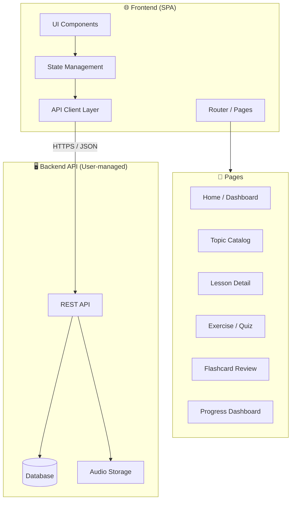

# System Design & Architecture — Chinese Learning Web

## Architecture Overview
**What is the high-level system structure?**



### Key Architecture Decisions
- **Frontend-only scope** — The backend is a separate system managed by the user. The frontend consumes its REST API.
- **SPA with client-side routing** — Single Page Application for smooth, app-like navigation.
- **API Client layer** — Centralized API module with typed request/response handling for easy endpoint swapping.
- **State management** — Lightweight store for caching fetched lessons, user progress, and UI state.

### Technology Stack ✅ Confirmed
| Layer | Choice | Rationale |
|-------|--------|-----------|
| Build Tool | **Vite** | Fast HMR, modern ESM-based bundling |
| Framework | **React 18+** | User confirmed |
| Styling | **Vanilla CSS + CSS Variables** | Maximum control, custom design system |
| Routing | **React Router v6** | SPA navigation |
| State | **Zustand** | Lightweight, modern state management |
| HTTP Client | **Fetch API** | API communication (no extra deps) |
| Audio | **Web Speech API (TTS)** | Browser-native text-to-speech |
| Animations | **CSS Transitions + Framer Motion** | Premium micro-interactions |
| Icons | **Lucide React** | Modern, consistent iconography |

## Data Models
**What data do we need to manage?**

### Core Entities (as received from Backend API)

```
Topic {
  id: string
  title: string          // e.g. "打招呼 — Greetings"
  description: string
  icon: string           // emoji or icon URL
  lessonCount: number
  order: number
  coverImage?: string
}

Lesson {
  id: string
  topicId: string
  title: string          // e.g. "基本問候 — Basic Greetings"
  description: string
  order: number
  vocabulary: Vocabulary[]
  sentences: Sentence[]
  exercises: Exercise[]
  culturalNote?: string
}

Vocabulary {
  id: string
  character: string      // 你好
  pinyin: string         // nǐ hǎo
  zhuyin?: string        // ㄋㄧˇ ㄏㄠˇ
  meaning: string        // Xin chào (Vietnamese) / Hello
  audioUrl?: string
  strokeOrder?: string[] // SVG paths or animation data
  exampleSentences: string[]
}

Sentence {
  id: string
  chinese: string        // 你好！你叫什麼名字？
  pinyin: string
  zhuyin?: string
  translation: string
  audioUrl?: string
}

Exercise {
  id: string
  type: "multiple_choice" | "fill_blank" | "matching" | "character_writing" | "listening"
  question: string
  options?: string[]
  correctAnswer: string | string[]
  explanation?: string
}

UserProgress {
  topicId: string
  lessonId: string
  completed: boolean
  score: number
  lastStudied: Date
  masteryLevel: number   // 0-5 scale
}
```

## API Design
**How do components communicate?**

### Expected Backend Endpoints (to be confirmed by user)

| Method | Endpoint | Description |
|--------|----------|-------------|
| GET | `/api/topics` | List all topics with metadata |
| GET | `/api/topics/:id` | Get topic detail |
| GET | `/api/topics/:id/lessons` | List lessons for a topic |
| GET | `/api/lessons/:id` | Get full lesson with vocab, sentences, exercises |
| GET | `/api/progress` | Get user's progress data |
| POST | `/api/progress` | Update user's progress after completing a lesson |
| GET | `/api/review/flashcards` | Get flashcards due for review (spaced repetition) |

### Frontend API Client Pattern
```
apiClient.ts
├── topics.getAll()
├── topics.getById(id)
├── lessons.getByTopic(topicId)
├── lessons.getById(id)
├── progress.get()
├── progress.update(data)
└── review.getFlashcards()
```

## Component Breakdown
**What are the major building blocks?**

### Page Components
1. **HomePage** — Hero section, featured topics, daily word, progress summary.
2. **TopicCatalogPage** — Grid of topics with icons, descriptions, and progress indicators.
3. **LessonDetailPage** — Step-by-step lesson content: vocab cards → sentences → cultural notes → exercises.
4. **ExercisePage** — Interactive quiz with multiple exercise types, scoring, and feedback animations.
5. **ReviewPage** — Flashcard-style review with flip animations, spaced repetition.
6. **ProgressPage** — Dashboard showing completion stats, streaks, achievements.
7. **LoginPage** — Authentication form (login / register toggle).

### Shared UI Components
- `TopicCard` — Visual card with topic icon, title, progress bar.
- `VocabularyCard` — Flip card showing character, pinyin/zhuyin (both displayed), meaning, TTS audio button.
- `SentenceDisplay` — Sentence with hover-to-reveal translation, TTS playback.
- `ExerciseRenderer` — Dynamic renderer for different exercise types.
- `ProgressBar` — Animated circular/linear progress indicator.
- `TTSButton` — Play pronunciation via Web Speech API with zh-TW voice.
- `Navbar` — Top navigation with logo, links, user avatar, theme toggle.
- `ThemeToggle` — Dark / Light mode switch.
- `LoadingSkeleton` — Skeleton loading placeholders for API fetches.
- `AuthGuard` — Route protection component for authenticated routes.

## Design Decisions
**Why did we choose this approach?**

1. **Content from API, not hardcoded** — Enables the user to manage all content through their backend without frontend redeployment.
2. **Topic-based organization** — Familiar structure for language learners, allows progressive difficulty.
3. **Component-driven architecture** — Reusable, testable UI pieces that compose into pages.
4. **CSS Variables design system** — Custom design tokens for colors, spacing, typography enable a unique, premium look while keeping CSS maintainable.
5. **Progressive enhancement** — Core content works without JS-heavy features; animations and interactivity enhance the experience.

## Non-Functional Requirements
**How should the system perform?**

- **Performance**: Lighthouse mobile score ≥ 85; initial page load < 2s on 4G.
- **Accessibility**: WCAG 2.1 AA compliance; keyboard navigation; screen reader support for lesson content.
- **Responsiveness**: Fully functional on 320px–1920px viewports.
- **Offline resilience**: Graceful degradation with friendly error states when offline.
- **SEO**: Proper meta tags, semantic HTML, og:image for topic sharing.
- **Browser support**: Latest 2 versions of Chrome, Firefox, Safari, Edge.
