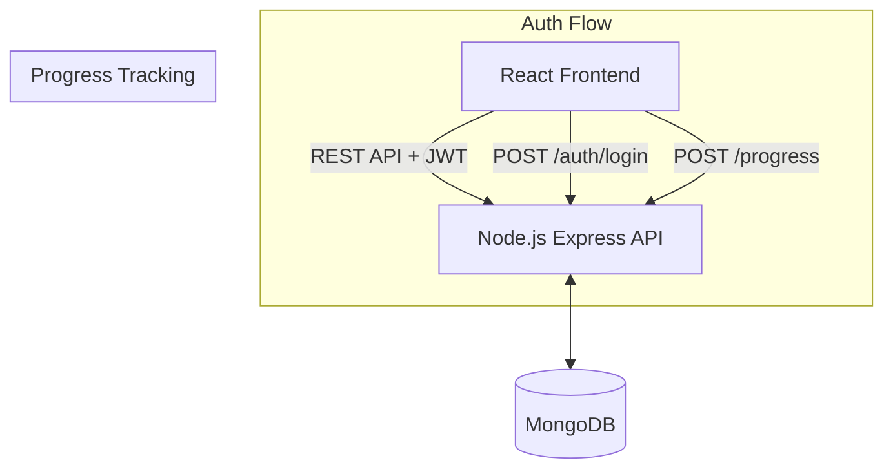

# System Design & Architecture

## Architecture Overview
**High-level system design**

- **Backend Framework:** Node.js with Express.
- **Database:** MongoDB (via Mongoose).
- **Authentication:** JWT (JSON Web Tokens) stored in localStorage (Frontend) and validated via Express middleware.
- **Password Hashing:** `bcryptjs`.

## Data Models & Schema
**Core entities and their relationships**

1.  **User (Người dùng)** (MongoDB Collection: `users`)
    - `_id` (ObjectId)
    - `name` (String)
    - `email` (String, Unique)
    - `password` (String, Hashed)
    - `role` (String, enum: ['user', 'admin'], default: 'user')

2.  **UserProgress (Tiến độ học tập)** (MongoDB Collection: `user_progress`)
    - `_id` (ObjectId)
    - `user_id` (ObjectId, Ref: User)
    - `lesson_id` (ObjectId, Ref: Lesson)
    - `completed` (Boolean)
    - `score` (Number)
    - `mastery_level` (Number, 0-5)
    - *Compound Index:* `{ user_id: 1, lesson_id: 1 }` (Unique)

3.  **Sentence (Câu ví dụ)** (MongoDB Collection: `sentences`)
    - `_id` (ObjectId)
    - `lesson_id` (ObjectId, Ref: Lesson)
    - `chinese` (String)
    - `pinyin` (String)
    - `zhuyin` (String)
    - `translation` (String)
    - `vocabulary_refs` (Array of ObjectIds, optional linking to words)

4.  **Exercise (Bài tập trắc nghiệm)** (MongoDB Collection: `exercises`)
    - `_id` (ObjectId)
    - `lesson_id` (ObjectId, Ref: Lesson)
    - `type` (String, Enum: 'multiple_choice', 'matching', 'fill_blank')
    - `question` (String)
    - `options` (Array of Strings)
    - `correctAnswer` (String)

## API Interfaces
**External communication contracts**

Base URL: `/api/v1`

**Auth & Users**
- `POST /auth/register` - Create a new user.
- `POST /auth/login` - Authenticate and return JWT.
- `GET /users/me` - Get current user profile (Requires Auth).

**Progress**
- `GET /progress` - Get all progress records for the current user (Requires Auth).
- `POST /progress/:lessonId` - Mark a lesson as complete/update score (Requires Auth).

**Learning Content (Updated)**
- `GET /lessons/:id` - (Updated) Must now populate `vocabulary`, `sentences`, and `exercises`.

## Component Breakdown
**Frontend Components**
- **Zustand Stores:**
  - `authStore.ts` - Manage JWT token, user info, login/logout functions.
  - `progressStore.ts` - Fetch and sync user progress.
- **Pages:**
  - `LoginPage.tsx` / `RegisterPage.tsx` - UI for authentication.

## Security & Privacy
- Passwords must be hashed using `bcrypt` before saving to the DB.
- Protect `/progress` and `/users/me` endpoints using an `authMiddleware` that verifies the JWT signature.
- Treat JWT securely; do not store highly sensitive info in the payload.

## Data Mocks / Seeding
- We need an updated seed script to generate basic Sentences and Multiple Choice exercises for the existing "Greetings" and "Numbers" lessons so the UI can be fully tested.
