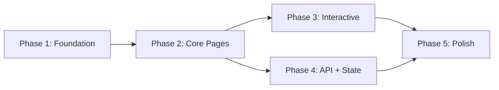

# Project Planning & Task Breakdown — Chinese Learning Web

## Milestones
**What are the major checkpoints?**

- [ ] **Milestone 1**: Project Setup & Design System — Scaffolded project, design tokens, base layout, theme toggle.
- [ ] **Milestone 2**: Core Pages & Navigation — Home, Topic Catalog, Lesson Detail pages with routing.
- [ ] **Milestone 3**: Interactive Learning — Exercise components, flashcard review, scoring & feedback.
- [ ] **Milestone 4**: API Integration & State — Connect all pages to backend API, implement state management & progress tracking.
- [ ] **Milestone 5**: Polish & Optimization — Animations, responsive fine-tuning, accessibility, performance audit.

## Task Breakdown
**What specific work needs to be done?**

### Phase 1: Foundation
- [ ] **Task 1.1**: Initialize project with **Vite + React + TypeScript** (`create-vite` template `react-ts`).
- [ ] **Task 1.2**: Install dependencies: `react-router-dom`, `zustand`, `lucide-react`, `framer-motion`.
- [ ] **Task 1.3**: Set up CSS design system — color palette, typography scale, spacing tokens, dark/light mode variables.
- [ ] **Task 1.4**: Create base layout component (Navbar, Footer, main content area).
- [ ] **Task 1.5**: Set up client-side routing (React Router).
- [ ] **Task 1.6**: Create mock data files mirroring expected API responses for development.

### Phase 2: Core Pages
- [ ] **Task 2.1**: Build **HomePage** — hero section, featured topics grid, daily word highlight, CTA buttons.
- [ ] **Task 2.2**: Build **TopicCatalogPage** — topic grid with `TopicCard` components, search/filter.
- [ ] **Task 2.3**: Build **LessonDetailPage** — vocabulary cards, sentence display, cultural notes, step-by-step layout.
- [ ] **Task 2.4**: Build shared UI atoms — `AudioButton`, `ProgressBar`, `LoadingSkeleton`, `ThemeToggle`.
- [ ] **Task 2.5**: Build `VocabularyCard` with flip animation, pinyin/zhuyin display, audio integration.
- [ ] **Task 2.6**: Build `SentenceDisplay` with hover translation reveal and audio playback.

### Phase 3: Interactive Learning
- [ ] **Task 3.1**: Build `ExerciseRenderer` — multiplex component that renders different exercise types.
- [ ] **Task 3.2**: Implement **Multiple Choice** exercise with feedback animations.
- [ ] **Task 3.3**: Implement **Fill-in-the-Blank** exercise with validation.
- [ ] **Task 3.4**: Implement **Matching** exercise (drag-and-drop or tap-to-match).
- [ ] **Task 3.5**: Build **ExercisePage** — sequential exercise flow, scoring, results summary.
- [ ] **Task 3.6**: Build **ReviewPage** — flashcard deck with flip animation, mark-as-known/unknown, spaced repetition queue.

### Phase 4: API Integration & State
- [ ] **Task 4.1**: Create API client module with typed functions for all endpoints.
- [ ] **Task 4.2**: Set up state management (Pinia/Zustand) for topics, lessons, progress.
- [ ] **Task 4.3**: Replace mock data with real API calls across all pages.
- [ ] **Task 4.4**: Build **ProgressPage** — dashboard with stats, streaks, achievement cards.
- [ ] **Task 4.5**: Implement progress persistence (POST results to backend after exercises).
- [ ] **Task 4.6**: Add error handling — loading skeletons, error states, retry buttons.

### Phase 5: Polish & Optimization
- [ ] **Task 5.1**: Add micro-animations — page transitions, card interactions, button hover effects.
- [ ] **Task 5.2**: Responsive fine-tuning — test and fix layouts on 320px, 768px, 1024px, 1440px.
- [ ] **Task 5.3**: Accessibility audit — keyboard navigation, ARIA labels, color contrast.
- [ ] **Task 5.4**: SEO — meta tags, semantic HTML, og:image, sitemap.
- [ ] **Task 5.5**: Performance audit — Lighthouse run, image optimization, code splitting.
- [ ] **Task 5.6**: Final QA — cross-browser testing, edge case handling.

## Dependencies
**What needs to happen in what order?**

- Phase 2 depends on Phase 1 (design system, routing, layout).
- Phase 3 and Phase 4 can be worked on in parallel after Phase 2.
- Phase 5 depends on Phase 3 + Phase 4 completion.
- **External dependency**: Backend API must be available (or mock servers used) before Phase 4.

## Timeline & Estimates
**When will things be done?**

| Phase | Estimated Effort | Notes |
|-------|-----------------|-------|
| Phase 1: Foundation | 1–2 days | Project setup and design system |
| Phase 2: Core Pages | 3–4 days | Main page layouts and components |
| Phase 3: Interactive | 3–4 days | Exercise engine and review system |
| Phase 4: API + State | 2–3 days | Depends on API readiness |
| Phase 5: Polish | 2–3 days | Animations, responsive, a11y |
| **Total** | **~11–16 days** | Solo developer pace |

## Risks & Mitigation
**What could go wrong?**

| Risk | Impact | Mitigation |
|------|--------|------------|
| Backend API not ready | Blocks Phase 4 | Use mock data server / JSON files through all phases |
| Scope creep (too many exercise types) | Delays launch | Start with 3 core types, add more post-v1 |
| Complex character stroke animation | High dev effort | Defer to Phase 5 or v2; use existing libraries (Hanzi Writer) |
| Performance with large vocab lists | Slow rendering | Virtual scrolling, pagination |

## Resources Needed
**What do we need to succeed?**

- **Libraries**: Vite, React 18+, React Router v6, Zustand, Lucide React, Framer Motion.
- **Design assets**: Google Fonts (Inter, Noto Sans TC), Lucide icons.
- **Audio**: Browser TTS (Web Speech API) with `zh-TW` locale.
- **Testing**: Vitest + React Testing Library.
- **Hosting**: Self-hosted (user-managed server).
